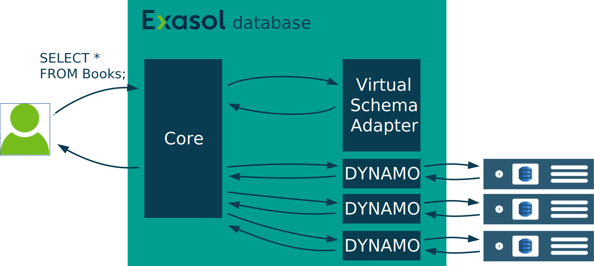

# Design for the Generic virtual-schema-common-document

## Project Architecture

We split the project into multiple repositories. The following figure illustrates their relationship. Each class in the diagram represents a repository.

```plantuml
class dyvs as "dynamodb-virtual-schema"
class cdf as "virtual-schema-common-document-files"
class cd as "virtual-schema-common-document"
class cj as "virtual-schema-common-java"

dyvs <|-- cd
cdf <|-- cd
cd <|-- cj
cd -o "edml-java"
"s3-document-files-virtual-schema" <|-- cdf
"google-cloud-storage-document-files-virtual-schema" <|-- cdf
"…" <|-- cdf
```

Wouldn't it be easier to put everything in one repository?

> Maybe yes. But that would have the downside that then all the products would have the same release cycle. (We want to use the GitHub UI for listing the releases --> having products with different lifecycle in one repo is too confusing).
>
> A different release cycle is important for rolling out changes step by step.

## Data Loading Using UDFs

`dsn~data-loading-using-udfs~1`

An Exasol Virtual Schema always rewrites one SQL statement into another SQL statement. It can not directly emit data. This Virtual Schema rewrites the query into a new query that calls Exasol [UDFs](https://docs.exasol.com/db/latest/database_concepts/udf_scripts.htm). The UDFs then fetch the data and emit it. We use this mechanism also for parallelizing. Since Exasol distributes the execution of UDFs over all nodes, that has the advantage that we use the full power of the Exasol cluster for the data loading.

Another advantage of this approach is that the emit-bandwidth of UDFs has an upper limit. By using multiple UDFs we can emit faster.



Covers:

* `req~custom-loader~1`

## Pipeline Architecture

`dsn~pipeline-architecture~1`

The Virtual Schema imports the data using a pipeline. That's important since it must be able to load more data than it fit into the RAM of the UDF.


`Document Fetcher`: dialect specific class that fetches the files, parses them and wraps read documents in a Java class structure.

`SchemaMapper`: Component in the virtual-schema-common-document that maps the document data to Rows based on the EDML-definition.

The Pipeline is implemented via `Iterators`. That means the data is pulled through the pipeline.

Covers:

* `req~small-memory-footprint~1`

### Ideas That Turned out not to be the Best

#### Java Streams

First we implemented the Pipeline via Java Streams. That turned out to be not a good idea, since the streams had a bad performance as long as we passed many small Objects. This could be solved by junking, but that's dangerous and complicated.

#### Akka Strams

Next we tried out [Akka Streams](https://doc.akka.io/docs/akka/current/stream/index.html). The idea was to decouple the loading of files from the processing and emitting so that we can use the time of the downloading for processing other data.

The first measured performance results were very poor because of synchronization overhead.
We could improve it then by chunking the data and only passing the chunks. By that we could again improve the performance but did not reach our goals.

Chunking is problematic because it increases the memory footprint of the UDFs since more data is in the pipeline at the same time. That again reduces the amount of UDFs we can start.
It's also dangerous since we can't predict how much memory the reading of a file will allocate. So the virtual-schema adapter could run out of memory.

Another aspect is that we already parallelize by starting multiple UDFs. So paralleling again adds overhead that turned out not to pay off.

## Predicate Pushown

`dsn~predicate-pushdown~1`


